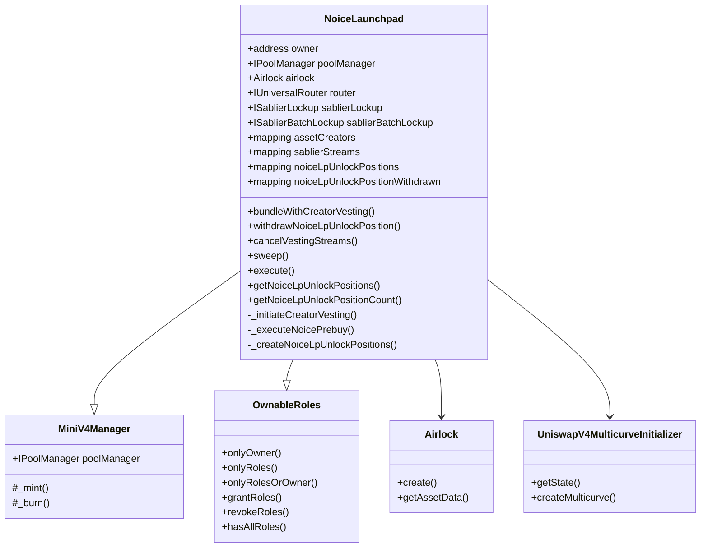
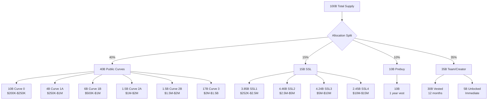
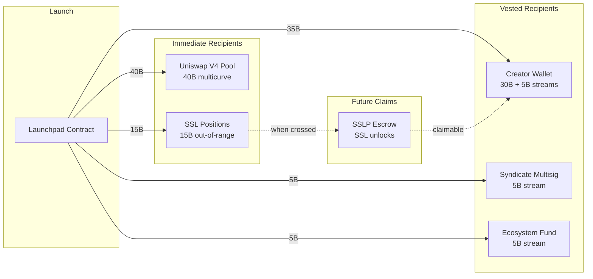
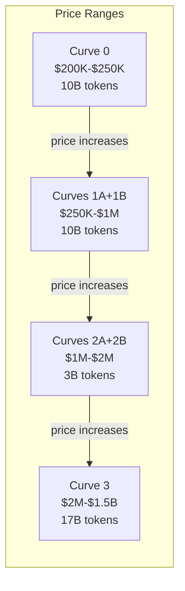
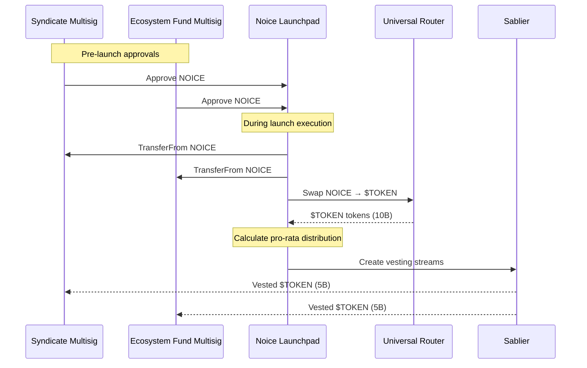
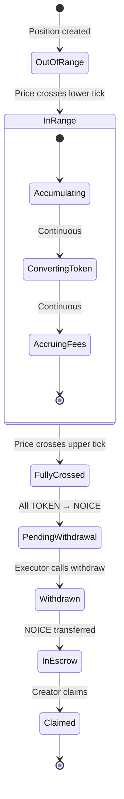
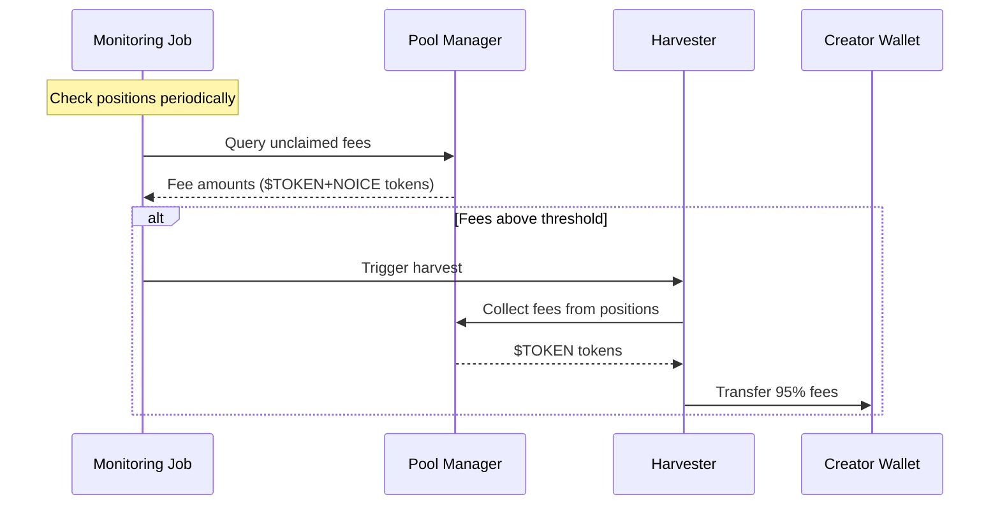

# Noice Launchpad Contracts

[Noice](https://noice.so) is a permissioned launchpad built on top of [Doppler Multicurve](https://doppler.lol/multicurve.pdf) and Uniswap V4.

---

## Table of Contents

1. [Acknowledgement](#acknowledgement)
2. [Core Features](#core-features)
   - [Multicurve](#1-multicurve)
   - [Creator Vesting with Linear Lockup](#2-creator-vesting-with-linear-lockup)
   - [Prebuy Mechanism with Vesting](#3-prebuy-mechanism-with-vesting)
   - [Single-Sided Liquidity Positions (SSLPs)](#4-single-sided-liquidity-positions-sslps)
3. [Launch Flow](#launch-flow)
4. [Core Contracts](#core-contracts)
5. [Contract Architecture](#contract-architecture)
6. [Token Allocation and Distribution Details](#token-allocation-and-distribution-details)
   - [Allocation at Launch](#allocation-at-launch)
   - [Circulation Over Time](#circulation-over-time)
   - [Token Destination Flow](#token-destination-flow)
7. [Multicurve Liquidity Details](#multicurve-liquidity-details)
8. [Prebuy + Vesting](#prebuy--vesting)
9. [Creator Allocation + Vesting](#creator-allocation--vesting)
10. [Single Side Liquidity Positions System](#single-side-liquidity-positions-system)
11. [Fee Management](#fee-management)
12. [Liquidity Efficiency Analysis](#liquidity-efficiency-analysis)
13. [Access Control Matrix](#access-control-matrix)
14. [Security & Audits](#security)

---

## Acknowledgement

This codebase is a fork of [Doppler](https://github.com/whetstoneresearch/doppler) at commit [`204d121`](https://github.com/whetstoneresearch/doppler/commit/204d1217c9a633cfe1f9b8da63feb649d0a9aa04).

The **Noice Launchpad** extends Doppler's Multicurve contracts — this fork provides compatibility with existing tests and scripting infrastructure.

---

## Core Features

### 1. Multicurve

[Doppler’s Multicurve](https://www.doppler.lol/multicurve.pdf) allocates liquidity in increasing tick ranges to form a stacked curve. Liquidity becomes denser as price rises, enabling efficient price discovery and better volatility resistance.

### 2. Creator Vesting with Linear Lockup

Founders receive the largest share of tokens via linear vesting. This keeps them aligned long-term while retaining ownership. Vesting is implemented through Sablier and supports delegation to team members.

**Code:** [`_initiateCreatorVesting()`](https://github.com/noiceengg/contracts/blob/main/src/NoiceLaunchpad.sol#L373-L425)

### 3. Prebuy Mechanism with Vesting

A portion of tokens is pre-purchased by ecosystem participants (using $NOICE). Tokens are distributed with vesting schedules to promote commitment.

**Code:** [`_executeNoicePrebuy()`](https://github.com/noiceengg/contracts/blob/main/src/NoiceLaunchpad.sol#L427-L505)

### 4. Single-Sided Liquidity Positions (SSLPs)

Founders allocate part of their tokens to single-sided positions that unlock progressively as price milestones are crossed — providing programmable liquidity.

**Code:** [`_createNoiceLpUnlockPositions()`](https://github.com/noiceengg/contracts/blob/main/src/NoiceLaunchpad.sol#L507-L573)

---

## Launch Flow

```text
1. Create token + Doppler multicurve Uniswap v4 pool (NOICE as quote)
2. Allocate SSL positions (out-of-range liquidity for milestone unlocks)
3. Allocate creator vesting positions (Sablier)
4. Execute prebuy (NOICE → Token) and distribute with vesting 
```

**Main Entry Point:** [`bundleWithCreatorVesting()`](https://github.com/noiceengg/contracts/blob/main/src/NoiceLaunchpad.sol#L204-L290)

## Core Contracts

- **NoiceLaunchpad**: Main orchestrator that coordinates all launch activities atomically in a single transaction ([source](https://github.com/noiceengg/contracts/blob/main/src/NoiceLaunchpad.sol))
- **Airlock**: Doppler's Airlock contract for token creation and pool initialization
- **MiniV4Manager**: Base contract providing Uniswap v4 position management
- **UniswapV4MulticurveInitializer**: Doppler's util that handles multicurve liquidity initialization
- **UniversalRouter**: Executes token swaps for the prebuy mechanism
- **Sablier**: Manages all vesting streams for creators and prebuy participants

### Contract Architecture 


## Token Allocation and Distribution Details
**Note:** These numbers might change and it serves as a reference for using the noice launchpad contract
### Allocation at Launch


### Circulation Over Time

**Immediate Circulation (t=0): 45B (45%)**
- 40B public curve positions
- 5B creator unlocked

**Progressive Unlock (t=0 to t=12mo): 40B (40%)**
- 10B prebuy (linear vest over 12 months)
- 30B creator (linear vest over 12 months)

**Price-Dependent Unlock: 15B (15%)**
- SSL positions unlock as price rises
- 4 tranches from $252K to $15M market cap
- Converted from $TOKEN → NOICE as positions cross

### Token Destination Flow


## Multicurve Liquidity Details

### Curve Positions (40B Total)

| Curve | Amount | FDV Range | Purpose |
|-------|---------|-----------|---------|
| Curve 0 | 10B | $200K-$250K | Prebuy liquidity |
| Curve 1A | 4B | $250K-$1M | Initial public liquidity |
| Curve 1B | 6B | $500K-$1M | Overlapping depth |
| Curve 2A | 1.5B | $1M-$2M | Growth phase |
| Curve 2B | 1.5B | $1.5M-$2M | Overlapping growth |
| Curve 3 | 17B | $2M-$1.5B | Late stage depth |

### Curve Shares (out of 1e18)
```solidity
Curve 0:  200000000000000000  (20.0% of 50B = 10B)
Curve 1A:  80000000000000000  (8.0% of 50B = 4B)
Curve 1B: 120000000000000000  (12.0% of 50B = 6B)
Curve 2A:  30000000000000000  (3.0% of 50B = 1.5B)
Curve 2B:  30000000000000000  (3.0% of 50B = 1.5B)
Curve 3:  340000000000000000  (34.0% of 50B = 17B)
Total:    800000000000000000  (80% = 40B public curves)
```

Note: The remaining 20% (10B) comes from prebuy participants filling Curve 0.

### Liquidity Distribution Visualization



## Prebuy + Vesting

### Participant Structure

**Syndicate Multisig**
- Amount: ~191M NOICE (50% of prebuy)* 
- Vesting: 1 year linear
- Receives: 5B $TOKEN tokens vested

**Ecosystem Fund Multisig**
- Amount: ~191M NOICE (50% of prebuy)*
- Vesting: 1 year linear
- Receives: 5B $TOKEN tokens vested

*: Dependent on the $NOICE Pricing

**Code:** [`NoicePrebuyParams` struct](https://github.com/noiceengg/contracts/blob/main/src/NoiceLaunchpad.sol#L44-L52) | [`_executeNoicePrebuy()` implementation](https://github.com/noiceengg/contracts/blob/main/src/NoiceLaunchpad.sol#L427-L505)

### Execution Flow


## Creator Allocation + Vesting

### Allocation Breakdown

**Creator Vesting (35B tokens)**
- 30B vested over 12 months
- 5B unlocked immediately
- All streams created via Sablier batch
- Recipient: Creator Privy Wallet

**Code:** [`CreatorAllocation` struct](https://github.com/noiceengg/contracts/blob/main/src/NoiceLaunchpad.sol#L28-L33) | [`_initiateCreatorVesting()` implementation](https://github.com/noiceengg/contracts/blob/main/src/NoiceLaunchpad.sol#L373-L425)

### Vesting Structure
```solidity
struct CreatorAllocation {
    address recipient;        // Creator Privy Wallet
    uint256 amount;          // 30B or 5B
    uint40 lockStartTimestamp;
    uint40 lockEndTimestamp; // +12 months or immediate
}
```

## Single Side Liquidity Positions System

### SSL Position Lifecycle


**Code:** [`NoiceLpUnlockPosition` struct](https://github.com/noiceengg/contracts/blob/main/src/NoiceLaunchpad.sol#L35-L42) | [`_createNoiceLpUnlockPositions()`](https://github.com/noiceengg/contracts/blob/main/src/NoiceLaunchpad.sol#L507-L573)

### Withdrawal Process

**Monitoring (Automated)**
- Track current pool tick
- Identify fully crossed positions
- Alert when withdrawal available

**Execution (Executor Role)**
```solidity
withdrawNoiceLpUnlockPosition(
    oracleAddress,
    trancheId
)
```

**Code:** [`withdrawNoiceLpUnlockPosition()` function](https://github.com/noiceengg/contracts/blob/main/src/NoiceLaunchpad.sol#L292-L346)

**Position Query Functions:**
- [`getNoiceLpUnlockPositions()`](https://github.com/noiceengg/contracts/blob/main/src/NoiceLaunchpad.sol#L575-L586) - Get all SSL positions for a token
- [`getNoiceLpUnlockPositionCount()`](https://github.com/noiceengg/contracts/blob/main/src/NoiceLaunchpad.sol#L588-L590) - Get count of SSL positions

## Fee Management

### Fee Distribution

**Trading Fees: 2% Total**
- 0.1% to Doppler (Protocol - 5% of fees)
- 1.9% to Creator (95% of fees)

**Token Fee Split:**
- 95% to Creator
- 5% to Doppler

**Creator Share:**
- 1.9% of total trading volume
- Fees is earned in token/noice

#### Fee Harvesting Flow



## Liquidity Efficiency Analysis

### Constant vs Multicurve Comparison

If we used constant liquidity from $250K-$1.5B instead of multicurve:

| Range | Constant Supply | Multicurve Supply | Efficiency |
|-------|-----------------|-------------------|------------|
| $250K-$1M | 20.3B | 10B | 49% |
| $1M-$2M | 5.9B | 3B | 51% |
| $2M-$1.5B | 13.8B | 17B | 123% |

**Key Benefits:**
- Uses ~50% fewer tokens in early ranges
- Preserves more tokens for growth phases
- Improves capital efficiency by 2x in critical ranges

## Access Control Matrix

| Function | Owner | Executor | Creator | Notes |
|----------|-------|----------|---------|-------|
| [`bundleWithCreatorVesting()`](https://github.com/noiceengg/contracts/blob/main/src/NoiceLaunchpad.sol#L204-L290) | ✓ | ✓ | ✗ | Atomic launch |
| [`withdrawNoiceLpUnlockPosition()`](https://github.com/noiceengg/contracts/blob/main/src/NoiceLaunchpad.sol#L292-L346) | ✓ | ✓ | ✗ | Claim SSL NOICE |
| [`cancelVestingStreams()`](https://github.com/noiceengg/contracts/blob/main/src/NoiceLaunchpad.sol#L348-L371) | ✓ | ✗ | ✗ | Emergency only |
| [`sweep()`](https://github.com/noiceengg/contracts/blob/main/src/NoiceLaunchpad.sol#L592-L594) | ✓ | ✗ | ✗ | Token recovery |
| [`execute()`](https://github.com/noiceengg/contracts/blob/main/src/NoiceLaunchpad.sol#L596-L602) | ✓ | ✗ | ✗ | Arbitrary calls |
| `grantRoles()` | ✓ | ✗ | ✗ | Role management |

**Constants:**
- [`EXECUTOR_ROLE`](https://github.com/noiceengg/contracts/blob/main/src/NoiceLaunchpad.sol#L70) - Role for executing SSL withdrawals
- [`NOICE` address](https://github.com/noiceengg/contracts/blob/main/src/NoiceLaunchpad.sol#L75) - Quote token for all pools

## Security

### Audit

NoiceLaunchpad has been audited by [**Pashov Audit Group**](https://pashov.com).

- **Audit Period**: October 10, 2025 - October 13, 2025
- **Audited Commit**: [`4d7e8c2`](https://github.com/noiceengg/noice-launchpad/commit/4d7e8c22cd7bb7404c0747da85a8c21878e41b3a)
- **Audit Report**: attached [here](audits/NoiceLaunchpad-security-review_2025-10-11.pdf)
- **Remediation PR**: [Audit Fixes](https://github.com/noiceengg/noice-launchpad/pull/1)
