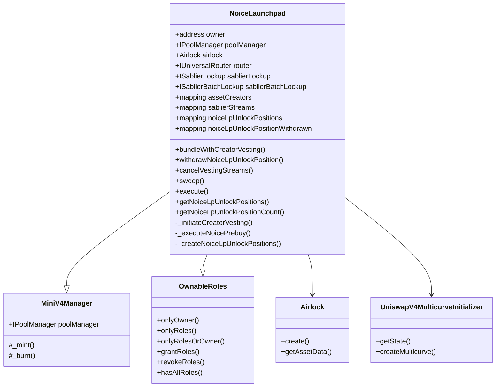

# Noice Launchpad Contracts 
[Noice](https://noice.so) is a permissioned launchpad built on top of [Doppler Multicurve](https://doppler.lol/multicurve.pdf) and Uniswap V4.


## Acknowledgement

This codebase is a fork of [Doppler](https://github.com/whetstoneresearch/doppler) at commit [`204d121`](https://github.com/whetstoneresearch/doppler/commit/204d1217c9a633cfe1f9b8da63feb649d0a9aa04).
The NoiceLaunchpad currently extends Doppler's Multicurve contracts and hence forking from the multicurve contracts have been helpful with tests and scripting.


## Core Features

  ### 1. Multicurve

  [Doppler's Multicurve](https://www.doppler.lol/multicurve.pdf) is a liquidity allocation strategy that stacks liquidity in tick ranges on top of each other to form a curve where liquidity in any given tick range is strictly increasing. This design significantly increases the cost of acquiring tokens within those ranges compared to a constant liquidity position. By concentrating liquidity more densely as price increases, Multicurve creates a more efficient price discovery mechanism and provides better protection against sudden price movements.

  ### 2. Creator Vesting with Linear Lockup

  Noice Launchpad prioritizes creators by allocating them the highest portion of the token supply, secured through linear vesting schedules. This ensures creators remain aligned with the long-term success of their project while maintaining meaningful ownership. Creators also have the flexibility to delegate portions of their vested allocation to team members or collaborators, with the same vesting parameters applied to delegated amounts.

  ### 3. Prebuy Mechanism with Vesting

  The launchpad implements a prebuy mechanism that allows early participants to commit quote tokens (i.e. NOICE) before the token launch. Once the token is launched, the launchpad automatically executes purchases at the earliest price range on
  behalf of prebuy participants. These acquired tokens are then distributed to participants with vesting schedules, incentivizing early support and promoting long term holding.

  ### 4. Single-Sided Liquidity Positions (SSLPs)

  The launchpad supports single-sided liquidity positions that enable creators to raise additional capital as
  their token appreciates. Creators can place their launched tokens in out-of-range liquidity positions at
  higher price points. As the token price crosses these milestones and enters the liquidity ranges, the tokens are gradually sold for the quote token, providing creators with progressive funding tied directly to their token's price progression.
  
### Launch Flow

```
┌─────────────────────────────────────────┐
│  1. Create token + Doppler multicurve   │
│     Uniswap v4 pool (NOICE as quote)    │
└──────────────────┬──────────────────────┘
                   │
                   ▼
┌─────────────────────────────────────────┐
│  2. Allocate tokens to create           │
│     NOICE LP unlock positions           │
│     (SSL: out-of-range positions that   │
│      unlock NOICE when crossed)         │
└──────────────────┬──────────────────────┘
                   │
                   ▼
┌─────────────────────────────────────────┐
│  3. Allocate tokens for creator         │
│     allocations (with Sablier vesting)  │
└──────────────────┬──────────────────────┘
                   │
                   ▼
┌─────────────────────────────────────────┐
│  4. Execute prebuy: swap NOICE → Token  │
│     and distribute with vesting         │
└─────────────────────────────────────────┘
```

## Core Contracts

- **NoiceLaunchpad**: Main orchestrator that coordinates all launch activities atomically in a single transaction 
- **Airlock**: Doppler's Airlock contract for token creation and pool initialization
- **MiniV4Manager**: Base contract providing Uniswap v4 position management
- **UniswapV4MulticurveInitializer**: Doppler's util that handles multicurve liquidity initialization
- **UniversalRouter**: Executes token swaps for the prebuy mechanism
- **Sablier**: Manages all vesting streams for creators and prebuy participants

### Contract Architecture 



## Access Control Matrix

| Function | Owner | Executor | Creator | Notes |
|----------|-------|----------|---------|-------|
| `bundleWithCreatorVesting()` | ✓ | ✓ | ✗ | Atomic launch |
| `withdrawNoiceLpUnlockPosition()` | ✓ | ✓ | ✗ | Claim SSL NOICE |
| `cancelVestingStreams()` | ✓ | ✗ | ✗ | Emergency only |
| `sweep()` | ✓ | ✗ | ✗ | Token recovery |
| `execute()` | ✓ | ✗ | ✗ | Arbitrary calls |
| `grantRoles()` | ✓ | ✗ | ✗ | Role management |

## Liquidity Efficiency Analysis

### Constant vs Multicurve Comparison

If we used constant liquidity from $250K-$1.5B instead of multicurve:

| Range | Constant Supply | Multicurve Supply | Efficiency |
|-------|-----------------|-------------------|------------|
| $250K-$1M | 20.3B | 10B | 49% |
| $1M-$2M | 5.9B | 3B | 51% |
| $2M-$1.5B | 13.8B | 17B | 123% |

**Key Benefits:**
- Uses ~50% fewer tokens in early ranges
- Preserves more tokens for growth phases
- Creates "valley effects" for accumulation zones
- Improves capital efficiency by 2x in critical ranges

## Security

### Audit

NoiceLaunchpad has been audited by [**Pashov Audit Group**](https://pashov.com).

- **Audit Period**: October 10, 2025 - October 13, 2025
- **Audited Commit**: [`4d7e8c2`](https://github.com/noiceengg/noice-launchpad/commit/4d7e8c22cd7bb7404c0747da85a8c21878e41b3a)
- **Audit Report**: attached [here](audits/NoiceLaunchpad-security-review_2025-10-11.pdf)
- **Remediation PR**: [Audit Fixes](https://github.com/noiceengg/noice-launchpad/pull/1)
