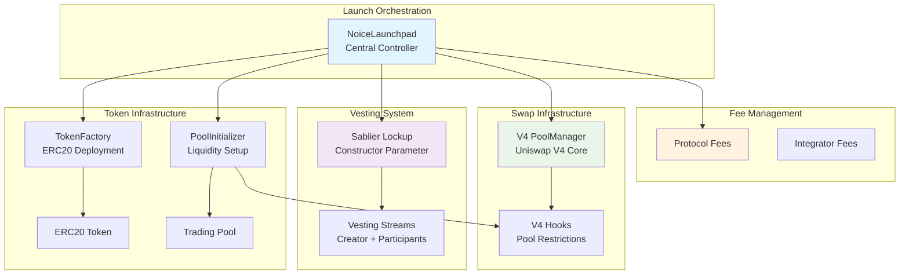
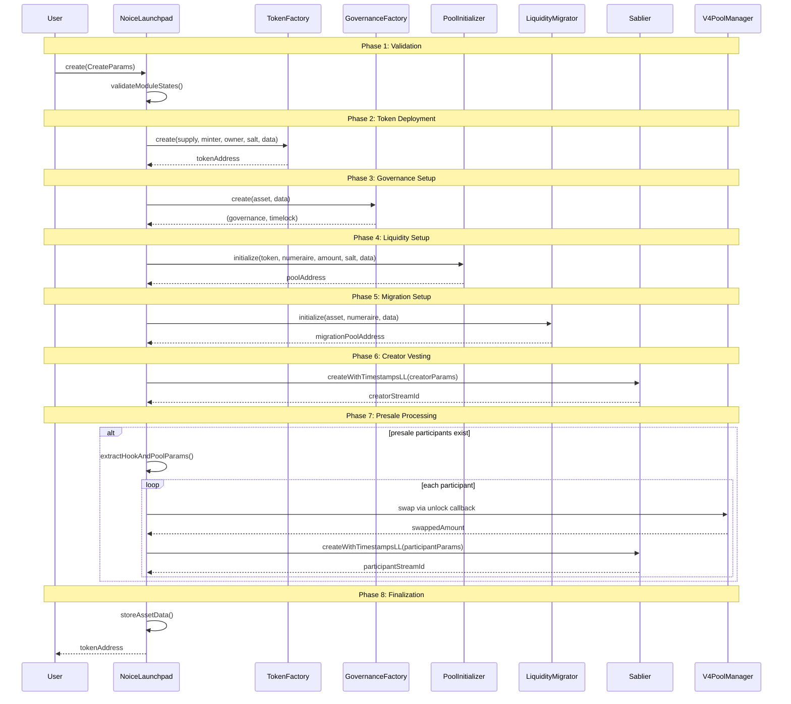

# NoiceLaunchpad

## Architecture Overview

- NoiceLaunchpad is a contract that sits on top of Doppler multicurve contracts, leveraging Doppler's infrastructure while serving essential token launch requirements.
- These requirements are: (a) allow creator allocation with vesting, (b) allow presale participants to participate in the pool before the token is available for others to trade (happens in the launch transaction), with vested token allocation, (c) collect fees earned from trading activity to protocol and integrators
- We use multicurve with v4 initializer, Sablier linear lockups for vesting, and fee collection mechanisms for revenue distribution

### Core Components

**NoiceLaunchpad**
- Orchestrates creator allocation and presale allocation in a single atomic transaction
- Stores asset metadata and manages token approvals throughout the process
- Handles fee collection and distribution to protocol and integrators
- Manages module state validation and authorization

**TokenFactory (Doppler component)**
- Creates ERC20 tokens with specified parameters and initial supply
- Supports deterministic deployments using CREATE2 with provided salt
- Mints entire initial supply to NoiceLaunchpad for distribution
- Returns deployed token address for subsequent operations

**PoolInitializer (Doppler multicurve pool)**
- Establishes primary Uniswap v4 pool with initial token allocation
- Configures pool parameters including fee tiers, tick spacing, and hooks
- Receives approved tokens from NoiceLaunchpad for liquidity provision
- Returns pool address for use in presale participant swaps



## Chronological Launch Flow

The launch process executes as a single atomic transaction with these sequential phases:

### Phase 1: Validation and Setup
- NoiceLaunchpad receives `create(CreateParams)` call from launcher
- Validates all factory contracts are whitelisted in module registry
- Validates presale participants count (max 100)
- Rejects transaction if any factory module lacks proper authorization

### Phase 2: Token Deployment
- TokenFactory creates new ERC20 contract with specified `initialSupply`
- All tokens minted directly to NoiceLaunchpad contract address
- Token contract ownership transferred to appropriate governance
- Returns deployed token address for subsequent operations

### Phase 3: Governance Setup
- GovernanceFactory creates governance and timelock contracts
- Governance contracts configured for token management
- Returns governance and timelock addresses

### Phase 4: Liquidity Provisioning
- NoiceLaunchpad approves PoolInitializer to spend `creatorVestTokenAmount` tokens
- PoolInitializer creates primary liquidity pool with approved token allocation
- Pool configured with extracted hook, fee, and tick spacing from InitData
- Pool becomes active for trading with initial token/numeraire pair
- Returns pool address for use in presale swaps

### Phase 5: Migration Pool Setup
- LiquidityMigrator creates migration pool for future use
- Token contract locks migration pool to prevent premature migration
- Returns migration pool address

### Phase 6: Creator Vesting Setup
- Calculate excess tokens available for creator: remaining balance after pool initialization
- Approve Sablier contract to spend calculated excess token amount
- Create linear vesting stream using `createWithTimestampsLL` function
- Stream configured with timelock as recipient and stored vesting schedule
- Creator tokens locked in Sablier contract until vesting periods begin

### Phase 7: Presale Processing
If presale participants exist:
- Transfer quote tokens from each participant to NoiceLaunchpad
- Extract hook, fee, and tick spacing from PoolInitializer's InitData
- Create PoolKey with extracted parameters for consistent pool configuration
- Execute V4 swap through PoolManager to convert quote tokens to launched tokens
- Calculate proportional token allocation for each participant
- Create individual vesting streams for each participant's token allocation
- Handle remaining dust tokens by transferring to timelock

### Phase 8: State Finalization
- Store complete AssetData mapping for deployed token
- Record all relevant contract addresses and configuration
- Emit Create event with token, numeraire, and pool addresses
- Return deployed token address to caller



## Core Operations

### Token Creation
- Deploy ERC20 via TokenFactory with specified initial supply
- All tokens initially minted to NoiceLaunchpad contract
- PoolInitializer receives approval for `creatorVestTokenAmount` amount
- Primary liquidity pool established with approved token allocation

### Creator Vesting
- Calculate excess allocation: remaining token balance after pool initialization
- Create linear vesting stream through Sablier's `createWithTimestampsLL` function
- Stream recipient set to timelock contract for governance control
- Vesting period defined by `creatorVestingStartTimestamp` and `creatorVestingEndTimestamp`
- Tokens remain locked in Sablier contract until vesting schedule permits withdrawal

### Presale Execution
- Transfer quote tokens from each participant to launchpad contract
- Extract hook, fee, and tick spacing from PoolInitializer's InitData
- Execute V4 swap converting quote tokens to newly launched token using extracted pool parameters
- Calculate proportional token allocation based on participant contribution
- Create individual Sablier vesting stream for each participant's token allocation
- Each participant receives their own customized vesting schedule

## V4 Swap Integration


### Swap Parameters
- Hook, fee, and tick spacing extracted from UniswapV4MulticurveInitializer
- Swap direction determined by token address comparison: `zeroForOne = quoteToken < asset`
- Amount specified as negative integer for exact input swaps: `amountSpecified = -int256(amountIn)`
- Price limits set using TickMath constants: `MIN_SQRT_PRICE + 1` or `MAX_SQRT_PRICE - 1`
- Swaps execute atomically within the launch transaction through unlock callback mechanism

## Sablier Integration

### Stream Creation
- Uses Sablier's `ISablierLockup` interface configured via constructor parameter
- Creates linear vesting streams via `createWithTimestampsLL` function
- Streams use precise timestamp boundaries rather than duration calculations
- Each stream configured with sender, recipient, token, and vesting schedule
- Supports both creator and individual participant vesting streams

### Stream Parameters
- Direct parameter passing without complex struct creation
- Cliff time set to zero for immediate vesting start
- Start and cliff amounts set to zero for linear vesting
- Streams marked as cancelable and transferable
- Linear vesting ensures consistent token release over vesting period

## Fee Distribution

### Protocol and Integrator Fees
- Protocol fees tracked per token in `getProtocolFees` mapping
- Integrator fees tracked per integrator per token in `getIntegratorFees` mapping
- Fees collected through trading activity and stored for withdrawal
- `Collect` event emitted when fees are distributed to recipients

## Data Structures

### CreateParams
```solidity
struct CreateParams {
    uint256 initialSupply;                          // Total token supply at launch
    uint256 creatorVestTokenAmount;                 // Tokens allocated for creator vesting
    address numeraire;                              // Base token for trading pairs
    ITokenFactory tokenFactory;                    // Factory contract for token deployment
    bytes tokenFactoryData;                         // Data for token factory
    IGovernanceFactory governanceFactory;          // Factory for governance contracts
    bytes governanceFactoryData;                    // Data for governance factory
    IPoolInitializer poolInitializer;              // Contract handling pool creation
    bytes poolInitializerData;                     // Data containing hook, fee, tick spacing
    ILiquidityMigrator liquidityMigrator;          // Contract for future migration
    bytes liquidityMigratorData;                   // Data for migration setup
    uint256 creatorVestingStartTimestamp;          // When creator vesting begins
    uint256 creatorVestingEndTimestamp;            // When creator vesting completes
    PresaleParticipant[] presaleParticipants;      // Array of presale allocations
    address quoteToken;                            // Token used for presale purchases
    address integrator;                            // Frontend integrator address
    bytes32 salt;                                  // Salt for CREATE2 deployments
}
```

### PresaleParticipant
```solidity
struct PresaleParticipant {
    address presaleParticipant;                    // Recipient of vested tokens
    uint256 presaleNoiceAmount;                    // Quote token amount to swap
    uint256 presaleVestingStartTimestamp;          // Individual vesting start
    uint256 presaleVestingEndTimestamp;            // Individual vesting end
    uint256 presaleEscrow;                         // Escrow amount (if applicable)
}
```

### AssetData
```solidity
struct AssetData {
    address numeraire;                             // Base trading token
    address timelock;                              // Governance timelock
    address governance;                            // Governance contract
    ILiquidityMigrator liquidityMigrator;         // Migration contract
    IPoolInitializer poolInitializer;             // Pool initializer
    address pool;                                  // Primary trading pool
    address migrationPool;                         // Future migration pool
    uint256 creatorVestTokenAmount;               // Creator vesting allocation
    uint256 totalSupply;                          // Total token supply
    address integrator;                           // Frontend integrator
    uint256 creatorVestingStartTimestamp;         // Creator vesting start
    uint256 creatorVestingEndTimestamp;           // Creator vesting end
    address quoteToken;                           // Presale quote token
    uint256 presaleParticipantCount;              // Number of presale participants
}
```